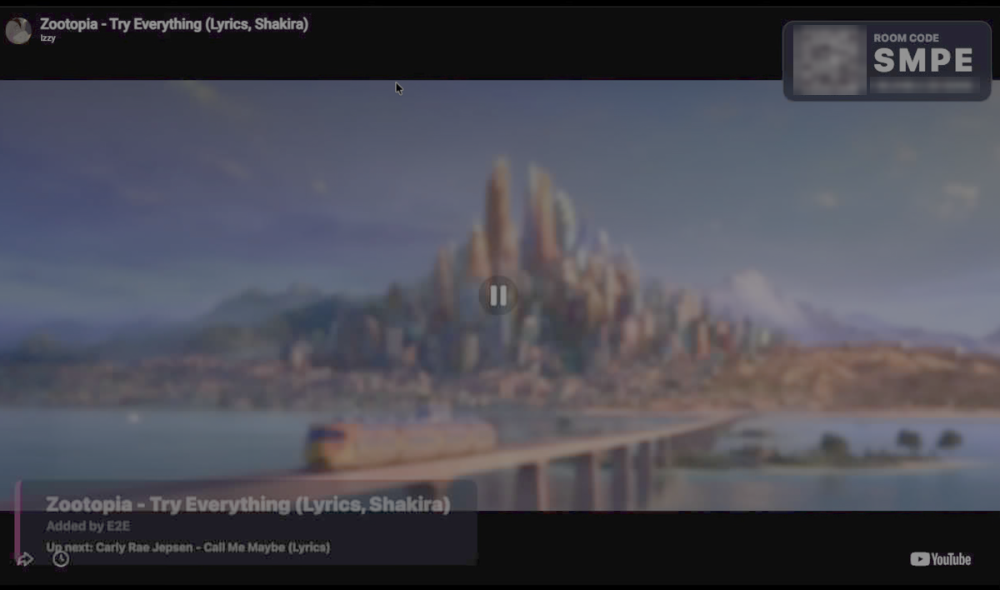
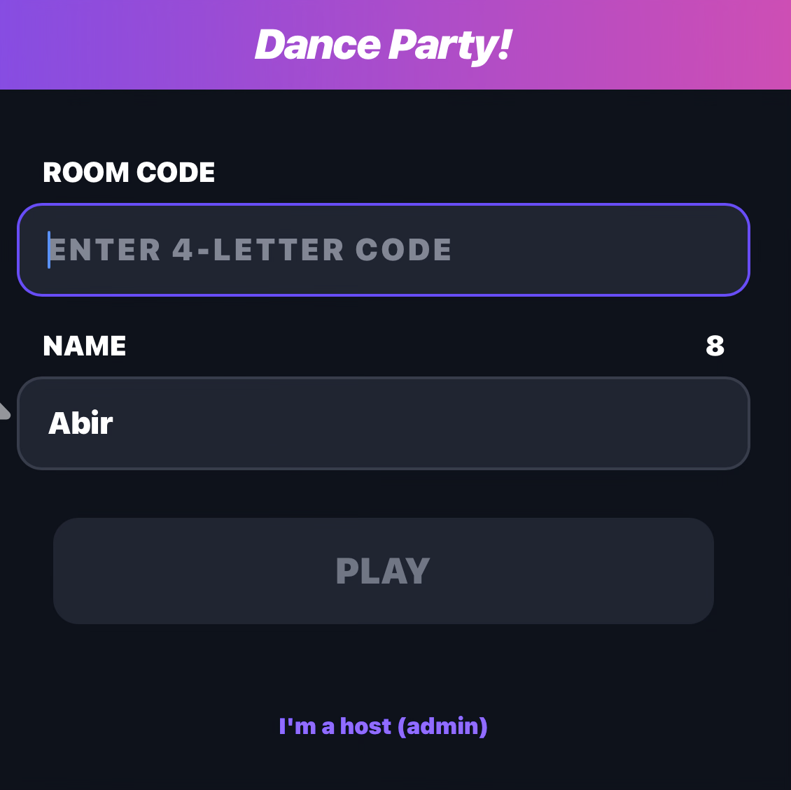
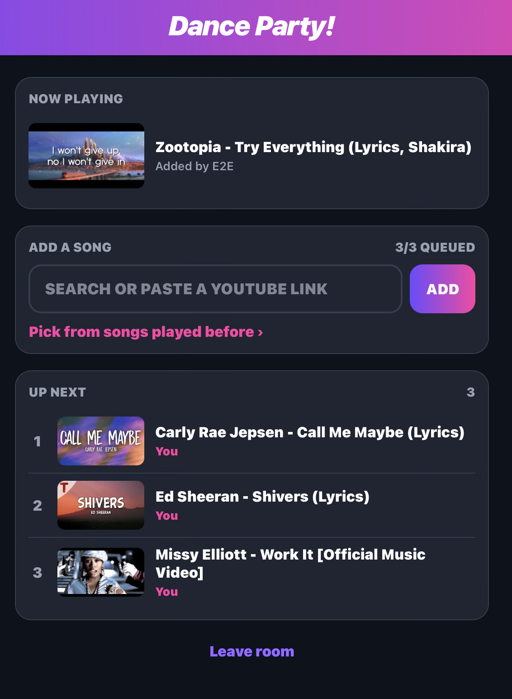
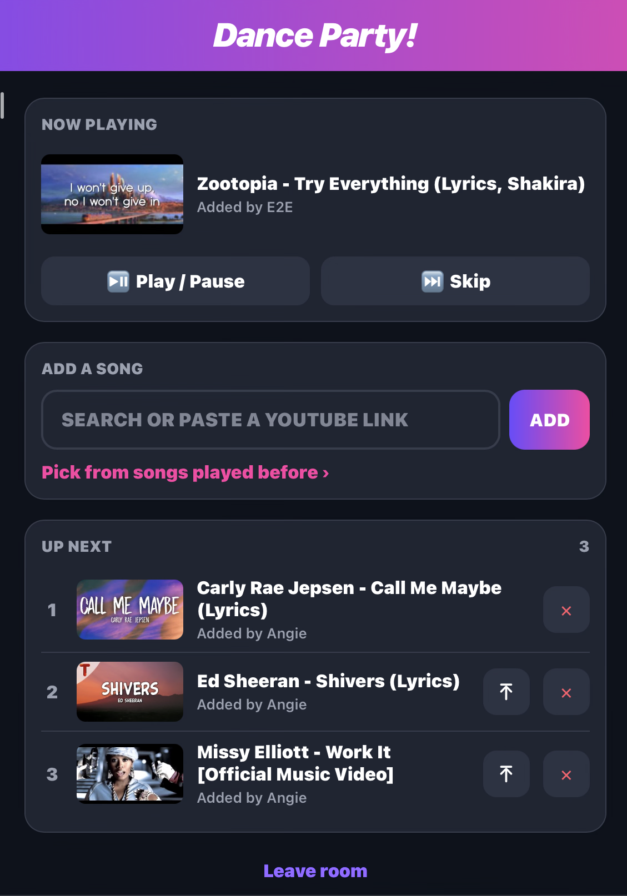
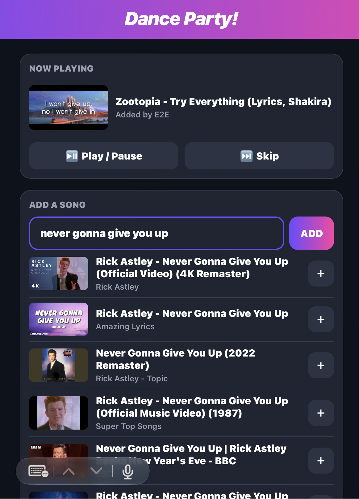
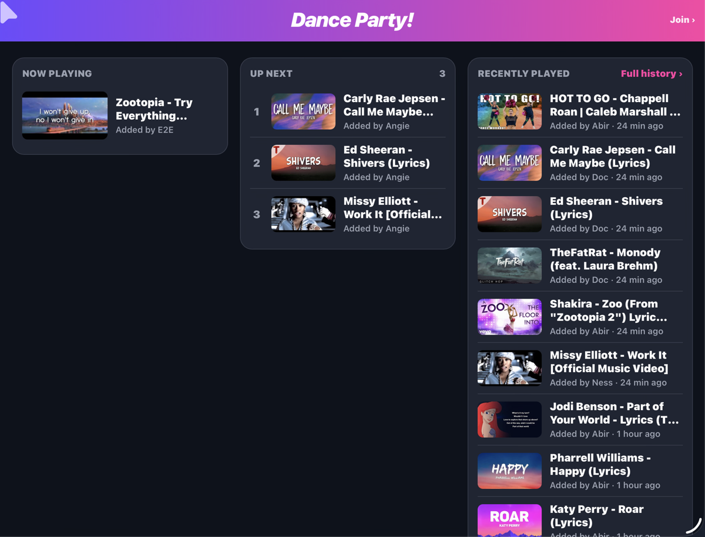

# 🪩 Dance Party!

A self-hosted YouTube jukebox for parties. Run it on a computer on your Wi-Fi, put the player page on the big screen (AirPlay, Chromecast, HDMI, or any TV with a browser), and guests queue songs from their phones.

Joining works like jackbox.tv: open the site on your phone, then enter the **4-letter room code** shown on the TV and your **name**.

## Screenshots

**TV player**: shows the video full screen, with the room code, a join QR code and what's up next



| Join | Guest | Admin | Search |
| :---: | :---: | :---: | :---: |
|  |  |  |  |

**`/queue`**: a read-only view of now playing, up next and recently played



## Roles

| | Guest | Admin |
|---|---|---|
| Add songs (paste a link or search) | ✅ up to 3 waiting | ✅ unlimited |
| Remove songs | | ✅ |
| Promote a song to play next | | ✅ |
| Play / pause, skip | | ✅ |

To become an admin, tap **"I'm a host (admin)"** on the join screen and enter the `ADMIN_PIN`.

## Setup

Requires Node.js 22+.

```bash
npm install
cp .env.example .env   # then edit ADMIN_PIN, TV_KEY, optionally YOUTUBE_API_KEY
npm start
```

### Docker

```bash
cp .env.example .env   # set ADMIN_PIN, TV_KEY, PUBLIC_URL and TV_HOST
docker compose up -d
docker compose logs dance-party   # room code and URLs
```

Inside a container the server can't detect your computer's LAN address or name, so set them in `.env`:
- `PUBLIC_URL`: the address phones should open, e.g. `http://192.168.1.50:3000`
- `TV_HOST`: the hostname the TV should use, e.g. `mymac.local` or `192-168-1-50.nip.io`

The database lives in the `dance-party-data` volume, so the queue, history and room code survive restarts and upgrades. To update, run `git pull && docker compose up -d --build`.

On startup, the server prints the room code, the phone URL and the TV player URL:

```
🪩  Dance Party! is running
   Room code: DANC
   Phones:    http://192.168.1.50:3000
   Admins:    http://192.168.1.50:3000/admin  (name + admin PIN, no room code)
   Queue:     http://192.168.1.50:3000/queue  (read-only, no sign-in)
   History:   http://192.168.1.50:3000/history  (every song played)
   TV player: http://localhost:3000/tv?key=...  (this computer)
              http://mymac.local:3000/tv?key=...  (any other device)
```

Tap the **?** in the top bar of any phone page for a quick "How it works" guide (or link straight to it with `#help`, e.g. `http://192.168.1.50:3000/#help`).

**Admins** can skip the room code: open `/admin` (e.g. `http://192.168.1.50:3000/admin`) and enter a name and the admin PIN. To make a one-tap bookmark, add the PIN after `#`: `http://192.168.1.50:3000/admin#pin=1234`. The part after `#` isn't sent to the server. Anyone with this link is an admin, so only share it with hosts.

**Queue board:** `/queue` (e.g. `http://192.168.1.50:3000/queue`) is a read-only, live-updating view of **Now playing**, **Up next** and **Recently played** (the last 10 songs, newest first). It doesn't need a room code. It's handy on a laptop or a second screen, and it shows three columns on wide screens. Viewers can't change anything, and the page never shows the room code. Songs the TV couldn't play aren't listed as played.

**Play history:** `/history` lists every song ever played, newest first and grouped by day. You can search it by title, channel or who added it, and tap a song to open it on YouTube. Once you've joined, each song has a **+** button that adds it to the queue again (guest limits apply). The phone page links there with **Pick from songs played before ›**. The history is stored in the SQLite database (`DB_PATH`), so it survives restarts. It's also available as JSON from `GET /api/history?limit=50&q=…&before=<next>`, where `next` comes from the previous page.

### Configuration (`.env`)

| Variable | Default | Description |
|---|---|---|
| `PORT` | `3000` | HTTP port |
| `ADMIN_PIN` | random per run | PIN that makes a user an admin |
| `TV_KEY` | random per run | Secret in the TV URL; only the TV page can report "song ended" |
| `YOUTUBE_API_KEY` | none | Turns on in-app search ([YouTube Data API v3](https://developers.google.com/youtube/v3/getting-started)). Without it, users paste links. |
| `GUEST_QUEUE_LIMIT` | `3` | Max songs a guest can have waiting |
| `DB_PATH` | `data/dance-party.db` | SQLite file (the queue and sessions survive restarts) |
| `ROOM_CODE` | generated once | Fixed 4-letter code, if you prefer |
| `PUBLIC_URL` | auto-detected LAN IP | Base URL shown on the TV and in the QR code |
| `TV_HOST` | this computer's Bonjour name (e.g. `mymac.local`) | Hostname other devices use for the TV page. Use `<ip-with-dashes>.nip.io` (e.g. `192-168-1-50.nip.io`) if a device can't resolve `.local` names |

## Putting it on the TV

The **TV player** is just a web page, so any screen that can show a browser window works.

1. Open the **TV player** URL in Chrome, Edge or Safari. Any computer or tablet on the Wi-Fi can run it:
   - On the computer running the server: `http://localhost:3000/tv?key=...`
   - On any other device: `http://<computer-name>.local:3000/tv?key=...` (both URLs are printed at startup).

   Open the page by name, not by IP address: YouTube refuses to embed some videos (error 150) on pages opened by IP. A `/tv` link opened by IP redirects automatically (to `localhost` on the server, or to `TV_HOST` elsewhere).
2. Leave it open. The page shows the room code while the queue is empty and starts playing as soon as a song is added. If the browser blocks sound, the video plays muted with a **Click for sound** prompt; click once.
3. Get it onto the TV, whichever way suits your setup:

   | TV setup | How |
   |---|---|
   | **HDMI** | Plug the computer into the TV and make the browser window full screen. This is the most reliable option. |
   | **AirPlay** (Apple TV, AirPlay-capable smart TVs) | **Mac:** Control Center → Screen Mirroring → your TV. Pick "Use As Separate Display" and drag the window there, or mirror the screen. **iPad:** Control Center → Screen Mirroring. |
   | **Chromecast / Google TV** | In Chrome: ⋮ menu → **Cast…** → choose your device. Cast the tab, or cast the screen with the window full screen. |
   | **TV with a web browser** | Open the `http://<computer-name>.local:3000/tv?key=...` URL in the TV's browser. Whether this works depends on how well the browser handles the YouTube player. |

4. If a computer is driving the TV, keep it awake. On a Mac, run `caffeinate -d` in a terminal.

When a video ends, the next song starts automatically. Videos that can't be embedded are skipped (with several TV pages open, only when none of them can play it). When the queue is empty, the TV shows the room code and a QR code for joining.

> Tip: if YouTube Premium is signed in, the TV browser won't show ads.

## Development

```bash
npm run dev    # auto-reload with tsx
npm test       # vitest: unit + socket integration tests
npm run build  # TypeScript → dist/
```

## How it works

- `src/app.ts`: Express + Socket.IO server. It's the single source of truth and broadcasts `state` to every client.
- `src/auth.ts`: room code, join, and admin PIN check. Session tokens are stored in SQLite and in each phone's localStorage.
- `src/queue.ts`: queue operations (add, remove, promote, advance) and the guest limit.
- `src/youtube.ts`: link parsing, oEmbed titles (no key needed) and Data API search.
- `public/`: plain HTML/JS pages: `index.html` (join, also served at `/admin`), `remote.html` (phone), `queue.html` (read-only queue board), `history.html` (play history), `tv.html` (YouTube IFrame player) and `help.js` (the shared help modal).
